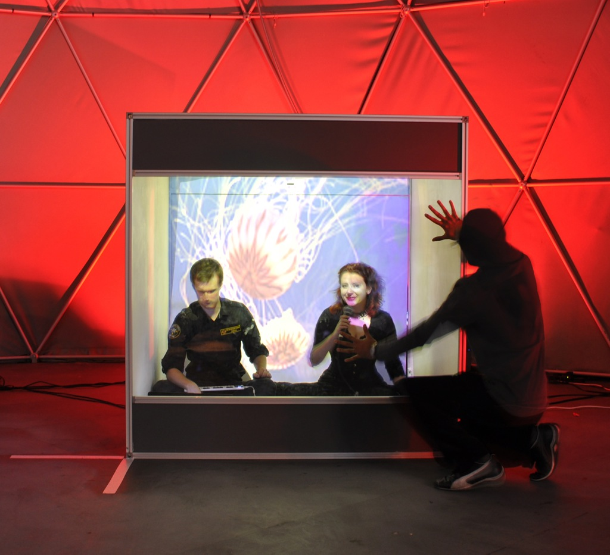
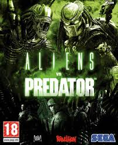
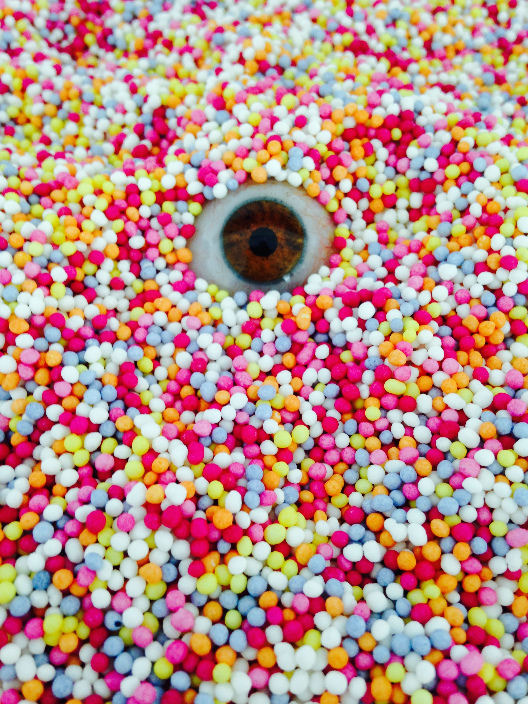

## Welcome to Games Computing

- 2016 start

## Structure

- About Us
- Showcase
- Activities this Semester
- Mundane stuff
- Game(s)
- Q&A

## About us
### your games specific staff

## Games @ intLab

- most of your games specific modules are taught by people active in games-related research
- these people are members on the Games subgroup of the Interactive Technologies Lab (intLab)
  - http://intlab.lincoln.ac.uk
  - http://games.lincoln.ac.uk

## Dr John Shearer

- Programme Leader for Games Computing
- Senior Lecturer

email
: **jshearer@lincoln.ac.uk**

office
: MC3116 (MHT building)

### Bio

- EyeResonator - http://www.eyeresonator.com
- nightingallery- http://www.robyntaylor.com/nightingallery.html
- humanaquarium- http://humanaquarium.org/

## Dr Patrick Dickinson

- Deputy Programme Leader for Games Computing
- Principle Lecturer (Enterprise)

email
: **pdickinson@lincoln.ac.uk**

### Bio

- Experienced games developer
- Worked at Rebellion Developments, and Awesome Developments
- Worked on: Aliens Vs Predator (PC, 2000), Jimmy White's 2: Cueball (1999, PC, Playstation), Jimmy White's Cueball World (2002, PC, Dreamcast).
- Interests include Computer Vision and Crowd Simulation

## Dr Greg Cielniak

- Senior Lecturer

email
: **gcielniak@lincoln.ac.uk**

### Bio

- Research interests include mobile robotics, machine perception, AI and in particular applications in agricultural robotics and food technology

## Andy Cowe

- Lecturer (part-time)

email
: **acowe@lincoln.ac.uk**

### Bio

- Experienced game developer
- Worked in design roles for Acclaim, Jester Interactive, Empire Interactive, VIS Entertainment, Atari, and Hands-On Mobile
- Now an independent developer at Moonjump, creator of mobile games

## Mark Doughty

- Principal Lecturer

email
: **mdoughty@lincoln.ac.uk**

### Bio

- social computing, zen and the art of motor racing

## Dr Kathrin Gerling

- Senior Lecturer

email
: **kgerling@lincoln.ac.uk**

### Bio

- Research interests in human-computer interaction (HCI) and accessibility

## Chris Headleand

- Lecturer

email
: **cheadleand@lincoln.ac.uk**

### Bio

- Interested in virtual humans and recreating social phenomenon with AI.
- Director for two companies, Ogwen Publishing and Picselica VR

## Dr Duncan Rowland

- Reader in Cultural Computing

email
: **drowland@lincoln.ac.uk**

### Bio

- Lead Programmer (Audio and Tools) Colin McRae Rally 3
- MA Fine Art - http://issuu.com/duncanrowland/docs/carry_on_regardless/18
- Art Show Contributions - http://neoalgorist.org/killers/
- Curatorial Practice

## Richard Wetzel

- Senior Lecturer

email
: **rwetzel@lincoln.ac.uk**

### Bio

- TimeWarp - augmented reality time travel game in the Old Town of Cologne (in 2010!)
- Studying curse breaking at Czocha College of Witchcraft and Wizardry (2015)
- Genesis of Cr0n - alternate reality game at GameCity (2014)
- Mixed Reality Game Cards - ideation cards for collaborative design of mixed reality games (2016)
- Research interests: mixed reality, pervasive games, game design, playfulness, ideation

# \#Dungeon

- http://www.hashtagdungeon.com
- https://twitter.com/HashtagDungeon

## \#Dungeon Trailer

<iframe width="960" height="540" src="https://www.youtube.com/embed/nbcpzCUwEMA?feature=player_detailpage" frameborder="0" allowfullscreen></iframe>

## \#Dungeon info

- built by two of our (ex) students
  - **Kieran Hicks** and Sean Oxspring
- for sale on itch.io NOW
  - http://oxyoxspring.itch.io/hashtag-dungeon
- for sale on Steam!!! from October 14th 2015
- ANY QUESTIONS for Kieran ??

# Activities

- things we're organising this coming Semester

## Possible Game city trip ???

- http://gamecity.org/festival/

### GameCity 11
### **Wednesday 26th - Saturday 29th October 2016**
### Nottingham, UK

> At last, a videogame festival for everybody.

- Every year, the best people in video games from around the world come to Nottingham to have the most fun.

- GameCity is about playing, watching, making, eating, shouting - all the best things.

- Together, we're going to find out what a videogame festival should be!

> there is no other festival in the World like GameCity ...
 - *The Guardian*

 

### Interested in us (or you) organising a trip

- i.e. us booking (probably free) coaches to/from Nottingham

## Game jams / Hackathons

- we facilitate these through the year
  - including Global Game January in the new year
- you can organise them also if you like (usually weekends)
- will be announced through blackboard
- some have prizes, some don't
- GREAT for portfolio

# mundane stuff

[lea-kane.deviantart.com](http://lea-kane.deviantart.com/art/Mundane-Navi-160049442)

## Programme Leader Role

- Point of contact for students who have difficulties related to the programme
  - BUT your personal tutor is your contact for personal or academic issues
  - or your module delivery team for academic aspects
- Oversee pastoral care of students
- Manage health and wellbeing of programmes
- Respond to issues raised by students and staff of a programme nature

## We will look (briefly) at...

- The programme for this year
- Timetables
- Where things are
- Facilities in the School
- SoCS Computing Laboratories: rules, etiquette, etc.
- A bit about using computers in the University
- How you should approach studying at University

## Level 1 Modules

| Module | Semesters | CATS |
|---|---|---|
| Programming and Data Structures | A&B | 30 |
| Personal Tutoring (non-assessed) | A&B | n/a |
| Maths for Computing | A | 15 |
| Web Authoring | A | 15 |
| Introductory Game Studies | A | 15 |
| Computer Architectures | B | 15 |
| Algorithms and Complexity | B | 15 |
| Game Design  | B | 15 |

## Timetables

- Your timetable should be available when you log on to the university computer system
- Or via blackboard
- You are studying **4 modules** this semester
- Each module should have a lecture (1 or 2 hours) & a workshop session (1 or 2 hours)
- Workshops: Usually in Lab A and B
- You are expected to attend all timetabled sessions: attendance is monitored
- Week1: You only have workshops in Week 1 if after the lecture for that module ...

## Where things are

- the School of Computer Science is mainly based on the third floor of MHT building
  - computing labs
  - most of your lecturer's offices (but not all)
  - college office (admin)
- Lab sessions always on the third floor, though swipe-card door

## Lab Facilities

- 3 Computing Labs: 3rd floor MHT building
- Not running campus install, we manage them and they're on their own subnet
- All used for workshops, but you can also use them when there are no timetabled workshop sessions on

### Lab Facilities 2

- The PCs are all high-spec
  - they are not all identical between labs
  - they should all have the same software on (in general)
- All use the username "computing" with the password "computing"
  - these are **NOT** private logins (yet ...)

## Lab Etiquette

- If a workshop session is on - vacate the lab, or do not enter
- **Store your work somewhere reliable** - **IMPORTANT**
  - SkyDrive
  - github/bitbucket/gitlab
  - a memory stick (though they are **NOT** reliable and get lost)
  - losing your work is not an accepted excuse for missed work
- Consider the machines as non-private, don't store passwords etc
- Remember to logout from web-services (e.g. facebook, twitter, ...)
  - browsers are in incognito mode by default to help
- The computers are regularly re-ghosted (any work saved on the local hard-drive will disappear)
- Don't bring food and drink into the lab
- Treat it like a professional dev studio

## Other Equipment

- Robotics stuff (some new fancy ones, a bunch of Rovios and Roombas kicking around), Lego NXT
- Quadcopters (John Murray)
- Mobile phones
- VR headsets (Oculus Rifts (DK1, DK2), HTC Vives ...) + we'll be getting more
- Ouyas
- Kinects (1 annd 2)
- Some Macs
- Raspberry Pis (various)
- random other stuff - keep your eyes open. Talk to people

## Blackboard

- Blackboard is the online learning environment used by the University.
- On Blackboard you will find:
  - Sections for the modules you are studying this semester: lecture notes, workshop materials, etc.
  - announcements, your timetable, etc.
- Most assessments are submitted electronically through Blackboard.
- You can (should) test Blackboard on Friday

Note: can demo with login=“astudent”, password=“astudent”

## Library

- Next to the Engine Shed
- To log into the library system
  - http://www.library.lincoln.ac.uk
  - Separate username and PIN number (check emailed)
  - Access catalogue, reserve/renew books, access e-books
- Subject Librarian: Carole Bee
- READ BOOKS and other stuff!!!

## Printing

- Large printers around the university
- You can print from any "standard" computer on campus, and collect from any printer
  - Or from our Labs
- To use printers:
  - login using library username and PIN

## What if I have a Problem?

- Extensive support structure in the University
  - not always obvious where to look for help
- Academic/work problems:
  - With a particular module: Lecturer / Module Coordinator (not always the same person)
  - Your **personal tutor**
  - Your programme leader: Me (John Shearer)
  - Your Head of School: presently Kevin Jackques (acting HoS)
  - You should feel that you can ask any member of staff for advice ...
    - this is part of all the staff members' jobs
- Non-Academic: Student Support Centre (Main Academic Building)
- **Remember: issues during Uni are common. Seek help/advice**

## Finding and contacting staff

- We, like you, are busy people
- We are not always in our offices
- Arrange meetings by email
- Write professional emails ... with our, and your names!!
- http://www.lincoln.ac.uk/home/socs/schoolstaff/

## Extra Curricula Activities

- "is this part of our assessment?"
  - Remember why you are here!

- Games jams, game challenges, workshops, competitions...
- Build your portfolio
- Discover your interests
  - sports and societies
  - etc. etc.

## Expectations

- Ours?
  - That you tell someone if you have a problem
  - That you attend timetabled sessions
  - That you follow lab rules
  - That you submit assessments on time
  - **That you treat other staff and students appropriately**
  - That you are enthusiastic!
- Yours?
  - ??
  - of us?
  - of each other?
  - of Uni?

## Advice

- Games industry is competitive
- Work outside your timetabled hours
  - i.e. 38-40 hours a week ...
- Find your interests
  - Level design, modding, hacking, mobile computing, etc
  - Your lecturers do more than teach
- If you have a problem, tell someone
- Talk to people
- Read

##A Learning Community

- source: https://commons.wikimedia.org/wiki/File:One_world_many_stories.svg

## Game Time

[misslunaviolet.deviantart.com](http://misslunaviolet.deviantart.com/art/Game-Time-36779346)

## FINALLY !!!

## Game 1 - another silly binary split (Rock-Paper-Scissors)

1. Get into pairs - with your new friends who are near you
2. Play Rock-Paper-Scissors, best of 3 in your pair
  - 3,2,1,Shoot
  - 3,2,1,Shoot
  - 3,2,1,Shoot
3. All victors on LHS of the room, everyone else on the RHS
  - your left/right, not my left/right

Note: need to split into two teams - doing with Rock-Paper-Scissors

## Game 1.1 - Rock-Paper-Scissors (again)

1. Find a new partner (on your side of the room)
2. Play Rock-Paper-Scissors, best of 3 in your pair
  - 3,2,1,Shoot
  - 3,2,1,Shoot
  - 3,2,1,Shoot
3. Stay on your **side** of the room
4. All victors to front of the room, everyone else to the back
  - we should now have 4 groups

## Game 1.2 - Rock-Paper-Scissors (again, again)

1. Find another new partner (in your group)
2. Play Rock-Paper-Scissors, best of 3 in your pair
  - 3,2,1,Shoot
  - 3,2,1,Shoot
  - 3,2,1,Shoot
3. Stay on your **group** of the room
4. All victors from each group get together, other also (but separately)
  - we should now have 8 groups

## Game 2 - Flying Questions Game

[simple.wikipedia.org/wiki/Paper](http://simple.wikipedia.org/wiki/Paper#mediaviewer/File:Paper_450x450.jpg)
[commons.wikimedia.org/wiki/File:Paperairplane.png](https://commons.wikimedia.org/wiki/File:Paperairplane.png)

## Flying Questions Game

- giving you (a hopefully fun) opportunity to ask questions
  - working in a team

- will have to fold/shape your piece of paper to get it as near as possible to a target
  - team who gets nearest will win prizes each
  - the paper must **FLY** - it cannot take a predominantly ballistic path

- https://commons.wikimedia.org/wiki/File:Trajectory_for_changing_launch_angle.gif
- https://commons.wikimedia.org/wiki/File:Archery_Target_80cm.svg

## Criteria

- 1 (or more) questions (for us to answer) per team
- 4 (or more) answers per team to
  - **why do you want to be here studying Games Computing?**
  - OR **how does this programme fit into your future plans?**
- 1 (or more) answers per team to
  - **how does the learning process work at University?**

## Game Play - Flying Questions Game

1. each team will work together
2. come get a large sheet of paper and a pen
3. you will have 5 minutes total
  - write your Q&A on the sheet
  - make the sheet so it will "fly"

## Q&A

- responding to questions and discussing people's answers

## Stay behind for a chat if you like

- hosted at http://shearer12345.github.io/talkGamesComputingProgrammeLevel1Welcome/
- source at https://github.com/shearer12345/talkGamesComputingProgrammeLevel1Welcome

## Extra

## The programmes

- 3 or 4 years for the degree
- 2 Semesters per year (A and B)
- 120 CATS points per year
- some modules are 15 CATS points, some of 30

### MComp Programmes

- Some of you are enrolled on MComp rather than BSc...
- Identical to corresponding BSc programmes for first 3 years
- Final year: More advanced stuff, more project work
- Points to remember:
  - Same assessments, but pass mark is higher (50%) in years 2 and 3
  - You can transfer later between BSc and MComp (either way)

### Level 1 Modules

| Module | Semesters | CATS |
|---|---|---|
| Programming and Data Structures | A&B | 30 |
| Personal Tutoring (non-assessed) | A&B | n/a |
| Maths for Computing | A | 15 |
| Web Authoring | A | 15 |
| Introductory Game Studies | A | 15 |
| Computer Architectures | B | 15 |
| Algorithms and Complexity | B | 15 |
| Game Design  | B | 15 |

### Level 2

- not definitive

| Module | Semesters | CATS |
| ---|---|---|
| Professional Practice | A | 15 |
| Human Computer Interaction | A | 15 |
| Object-Oriented Programming | A | 15 |
| Graphics | A | 15 |
| Group Project | B | 15 |
| Game Design 2 | B | 15 |
| Games Programming | B | 15 |
| Artificial Intelligence | B | 15 |

### Level 3

- not definitive

| Module | Semesters | CATS |
| ---|---|---|
| Project | A&B | 30 |
| Advanced Game Studies | A&B | 30 |
| Game Engine Architectures | A | 15 |
| *option*                  | A | 15 |
| Physics Simulation | B | 15 |
| *option* | B | 15 |

#### Level 3 Options:

- not definitive

| Option | Semesters | CATS |
| ---|---|---|
| Software Engineering | A | 15 |
| Entrepreneurship and Innovation 1 | A | 15 |
| Business Intelligence | A | 15 |
| Image Processing | A | 15 |
| Mobile Computing | A&B | 30 |
| Parallel Computing | B | 15 |
| Entrepreneurship and Innovation 2 | B | 15 |
| Autonomous Mobile Robotics | B | 15 |
| Critical Perspectives on Project Management | B | 15 |

### Level 4

- not definitive

| Module | Semesters | CATS |
| ---|---|---|
| Research Methods | A | 15 |
| Advanced Graphics | A | 15 |
| *option* | A | 15 |
| MComp Research Project | A&B | 60 (15 then 45) |
| Movement Interfaces | B | 15 |

#### Level 4 Options:

- not definitive

| Option | Semesters | CATS |
| ---|---|---|
| Advanced Programming | A | 15 |
| Advanced Artificial Intelligence | A | 15 |
| Advanced Software Engineering | B | 15 |
| Computer Vision | B | 15 |
| Machine Learning | B | 15 |
| **other M variants** | | |
