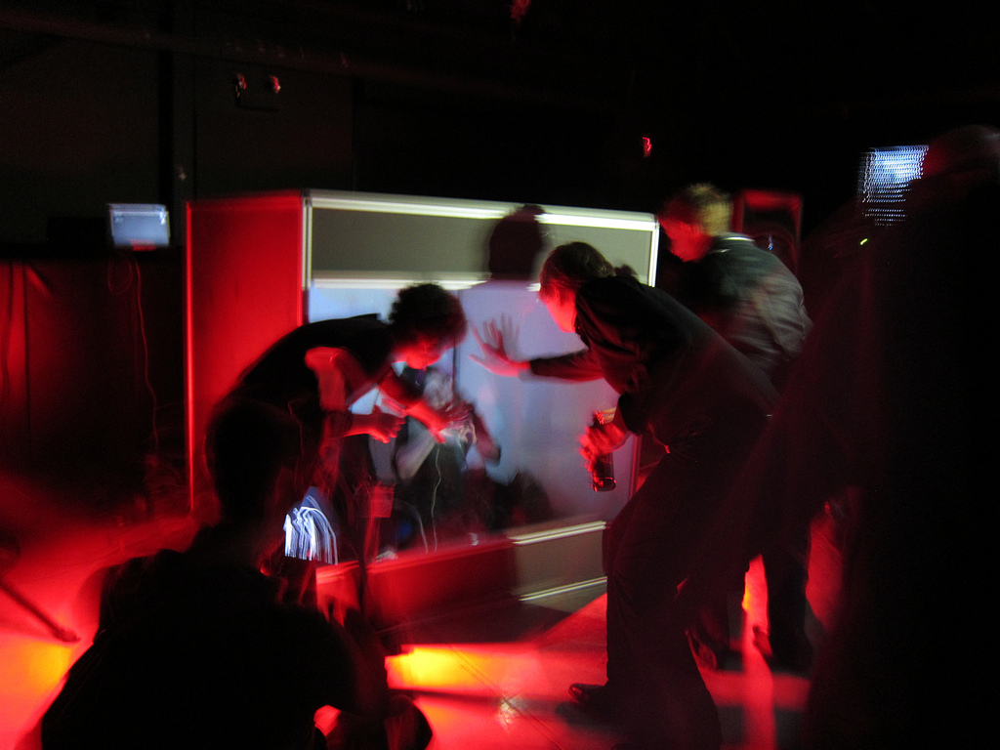
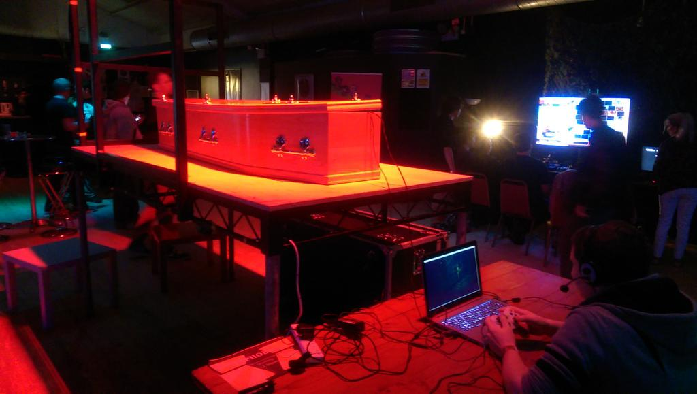

# Welcome

## to Games Computing

- hosted at http://shearer12345.github.io/talkGamesComputingProgrammeLevel1Welcome/
- source at https://github.com/shearer12345/talkGamesComputingProgrammeLevel1Welcome

## Overview

- we're going to play a bunch of games during this session
  - WOOT!!
  - we'll have some prizes
- we'll do some mundane stuff too - sorry

## Structure

- TODO

## About us
### your games specific staff

## Games @ IntLab

- most of your games specific modules are taught by people active in games-related research
- these people are members on the Games subgroup of the Interactive Technologies Lab (IntLab)
  - http://games.lincoln.ac.uk

## John Shearer

- Programme Leader for Games Computing
- Senior Lecturer

email
: **jshearer@lincoln.ac.uk**

office
: MC3116 (MHT building)

### Bio

- EyeResonator - http://www.eyeresonator.com
- nightingallery- http://www.robyntaylor.com/nightingallery.html
- humanaquarium- http://humanaquarium.org/

## Patrick Dickinson

- Deputy Programme Leader for Games Computing
- Principle Lecturer

email
: **pdickinson@lincoln.ac.uk**

### Bio

- Experience games developer
- Working at Rebellion Developments, and Awesome Developments
- Worked on: Aliens Vs Predator (PC, 2000), Jimmy White’s 2: Cueball (1999, PC, Playstation), Jimmy White’s Cueball World (2002, PC, Dreamcast).

## Greg Cielniak

- Senior Lecturer

email
: **gcielniak@lincoln.ac.uk**

### Bio

- Research interests include mobile robotics, machine perception, AI and in particular applications in agricultural robotics and food technology

## Andy Cowe

- Lecturer (part-time)

email
: **acowe@lincoln.ac.uk**

### Bio

- Experienced game developer
- Worked in design roles for Acclaim, Jester Interactive, Empire Interactive, VIS Entertainment, Atari, and Hands-On Mobile
- Now an independent developer at Moonjump, creator of mobile games

## Mark Doughty

- Principal Lecturer

email
: **mdoughty@lincoln.ac.uk**

### Bio

- social computing, zen and the art of motor racing

## Kathrin Gerling

- Senior Lecturer

email
: **kgerling@lincoln.ac.uk**

### Bio

- Research interests in human-computer interaction (HCI) and accessibility

## Ben Kirman

- Senior Lecturer

email
: **bkirman@lincoln.ac.uk**

### Bio

> Twice capped playing for England in the World Egg Throwing
Championships. Published science fiction, punk songs and homoerotic
fiction in a major computer science conference, father of the Dog
Internet and the only computing academic to have had articles about
their work simultaneously in New Scientist and Your Cat Magazine.

## Duncan Rowland

- Reader in Cultural Computing

email
: **drowland@lincoln.ac.uk**

### Bio

- Lead Programmer (Audio and Tools) Colin McRae Rally 3
- MA Fine Art - http://issuu.com/duncanrowland/docs/carry_on_regardless/18
- Art Show Contributions - http://neoalgorist.org/killers/
- Curatorial Practice

# \#Dungeon

- http://www.hashtagdungeon.com
- https://twitter.com/HashtagDungeon

## \#Dungeon Trailer

<iframe width="960" height="540" src="https://www.youtube.com/embed/nbcpzCUwEMA?feature=player_detailpage" frameborder="0" allowfullscreen></iframe>

## \#Dungeon info

- built by two of our (ex) students
  - **Kieran Hicks** and Sean Oxspring
- for sale on itch.io NOW
  - http://oxyoxspring.itch.io/hashtag-dungeon
- for sale on Steam!!! from October 14th 2015
- ANY QUESTIONS for Kieran ??

# Activities

- things we're organising this coming Semester

## Game city trip

- http://gamecity.org/

### GameCity 10
### **Thursday 22 - Saturday 31 October 2015**
### Nottingham, UK

> At last, a videogame festival for everybody.
  - http://gamecity.org/open-is-open/

- Every year, the best people in video games from around the world come to Nottingham to have the most fun.

- GameCity is about playing, watching, making, eating, shouting - all the best things.

- Together, we're going to find out what a videogame festival should be!

> there is no other festival in the World like GameCity ...
 - *The Guardian*

 

### Details to be announced

- Watch for Blackboard announcements
- All Computer Science students will be invited
  - Games Computing
  - Computer Science
  - Computer Information Systems
  - Social Computing
- We'll be booking (free) coaches to/from Nottingham

## Frequency festival

**In LINCOLN !!!**  23 OCTOBER - 1 NOVEMBER 2015

## #freq15

> The third edition of Frequency Festival returns to light up Lincoln with extraordinary art exhibitions, interactive performances, and lively conversations. With free events taking place across the city, there will be something for everyone to discover, as we explore ideas of digital liberation.

- http://frequency.org.uk/

### go along

- our own "Taphobos" is showing at the weekends

- http://taphobos.com/

### volunteer

- get involved, help out, meet people, have fun
- email me if you'd like to volunteer and I'll pass on your details
  - jshearer@lincoln.ac.uk

### guest lecture from **seeper**

- we're working to get a guest lecture / Q&A session / something with seeper
  - seeper are showing at Frequency Festival

<iframe class="stretch" src="http://player.vimeo.com/video/17113916?title=0" ></iframe>

### plan stuff for **frequencyFestival 2017** !!!!!!

- We'll be getting much more involved in Frequency Festival 2017
  - building games and other interactive experiences for 2017

## Game jams

- we facilitate these through the year
- you can organise them also if you like (usually weeks)
- will be announced through blackboard

# mundane stuff

[lea-kane.deviantart.com](http://lea-kane.deviantart.com/art/Mundane-Navi-160049442)

## Programme Leader Role

- Point of contact for students who have difficulties related to the programme
- Oversee pastoral care of students
- Manage health and wellbeing of programmes
- Respond to issues raised by students and staff of a programme nature

## We will look at...

- The programmes
- Timetables
- Where things are
- Facilities in the School
- SoCS Computing Laboratories: rules, etiquette, etc.
- A bit about using computers in the University
- How you should approach studying at University

## The programmes

- 3 or 4 years for the degree
- 2 Semesters per year (A and B)
- 120 CATS points per year
- some modules are 15 CATS points, some of 30

### MComp Programmes

- Some of you are enrolled on MComp rather than BSc...
- Identical to corresponding BSc programmes for first 3 years
- Final year: More advanced stuff, more project work
- Points to remember:
  - Same assessments, but pass mark is higher (50%) in years 2 and 3
  - You can transfer later between BSc and MComp (either way)

### Level 1 Modules

| Module | Semesters | CATS |
|---|---|---|
| Programming and Data Structures | A&B | 30 |
| Personal Tutoring (non-assessed) | A&B | n/a |
| Maths for Computing | A | 15 |
| Web Authoring | A | 15 |
| Introductory Game Studies | A | 15 |
| Computer Architectures | B | 15 |
| Algorithms and Complexity | B | 15 |
| Game Design  | B | 15 |

### Level 2

- not definitive

| Module | Semesters | CATS |
| ---|---|---|
| Professional Practice | A | 15 |
| Human Computer Interaction | A | 15 |
| Object-Oriented Programming | A | 15 |
| Graphics | A | 15 |
| Group Project | B | 15 |
| Game Design 2 | B | 15 |
| Games Programming | B | 15 |
| Artificial Intelligence | B | 15 |

### Level 3

- not definitive

| Module | Semesters | CATS |
| ---|---|---|
| Project | A&B | 30 |
| Advanced Game Studies | A&B | 30 |
| Game Engine Architectures | A | 15 |
| *option*                  | A | 15 |
| Physics Simulation | B | 15 |
| *option* | B | 15 |

#### Level 3 Options:

- not definitive

| Option | Semesters | CATS |
| ---|---|---|
| Software Engineering | A | 15 |
| Entrepreneurship and Innovation 1 | A | 15 |
| Business Intelligence | A | 15 |
| Image Processing | A | 15 |
| Mobile Computing | A&B | 30 |
| Parallel Computing | B | 15 |
| Entrepreneurship and Innovation 2 | B | 15 |
| Autonomous Mobile Robotics | B | 15 |
| Critical Perspectives on Project Management | B | 15 |

### Level 4

- not definitive

| Module | Semesters | CATS |
| ---|---|---|
| Research Methods | A | 15 |
| Advanced Graphics | A | 15 |
| *option* | A | 15 |
| MComp Research Project | A&B | 60 (15 then 45) |
| Movement Interfaces | B | 15 |

#### Level 4 Options:

- not definitive

| Option | Semesters | CATS |
| ---|---|---|
| Advanced Programming | A | 15 |
| Advanced Artificial Intelligence | A | 15 |
| Advanced Software Engineering | B | 15 |
| Computer Vision | B | 15 |
| Machine Learning | B | 15 |
| **other M variants** | | |

## Timetables

- Your timetable should be available when you log on to the university computer system
- Or via blackboard
- You are studying **4 modules** this semester
- Each module should have a lecture (1 or 2 hours) & a workshop session (1 or 2 hours)
- Workshops: Usually in Lab A and B
- You are expected to attend all timetabled sessions: attendance is monitored
- Week1: You only have workshops in Week 1 if after the lecture for that module ...

## Where things are

- the School of Computer Science is mainly based on the third floor of MHT building
  - computing labs
  - most of your lecturer's offices (but not all)
  - college office (admin)
- Lab sessions always on the third floor, though "pass key" door

## Lab Facilities

- 3 Computing Labs: 3rd floor MHT building
- Not running campus install, we manage them and they're on their own subnet
- All used for workshops, but you can also use them when there are no timetabled workshop sessions on
- The PCs are all high-spec.
  - they are not all identical between labs
  - they should all have the same software on (in general)
- All use the username "computing" with the password "computing"
  - these are **NOT** private logins, but give you admin rights

## Lab Etiquette

- If a workshop session is on - vacate the lab, or do not enter
- **Store your work somewhere reliable** - **IMPORTANT**
  - SkyDrive
  - github/bitbucket/gitlab
  - a memory stick (though they are **NOT** reliable and get lost)
  - losing your work is not an accepted excuse for missed work
- Consider the machines as non-private, don't store passwords etc
- Remember to logout from web-services (e.g. facebook, twitter, ...)
- The computers are regularly re-ghosted (any work saved on the local hard-drive will disappear)
- Don't bring food and drink into the lab
- Treat it like a professional dev studio

## Other Equipment

- Robotics stuff (some new fancy ones, a bunch of Rovios and Roombas kicking around), Lego NXT
- Quadcopters (John Murray)
- Mobile phones
- VR headsets (Oculus Rifts, ...) + we'll be getting more
- Ouyas
- Kinects
- Some Macs
- Raspberry Pis
- random other stuff - keep your eyes open. Talk to people

## Blackboard

- Blackboard is the online learning environment used by the University.
- On Blackboard you will find:
  - Sections for the modules you are studying this semester: lecture notes, workshop materials, etc.
  - announcements, your timetable, etc.
- Most assessments are submitted electronically through Blackboard.
- You can (should) test Blackboard on Friday

Note: can demo with login=“astudent”, password=“astudent”

## Library

- Next to the Engine Shed
- To log into the library system
  - http://www.library.lincoln.ac.uk
  - Separate username and PIN number (check emailed)
  - Access catalogue, reserve/renew books, access e-books
- Subject Librarian: Carole Bee
- READ BOOKS and other stuff!!!

## Printing

- Large printers around the university
- You can print from any "standard" computer on campus, and collect from any printer
  - Or from our Labs
- To use printers:
  - login using library username and PIN

## What if I have a Problem?

- Extensive support structure in the University
  - not always obvious where to look for help
- Academic/work problems:
  - With a particular module: Lecturer / Module Coordinator (not always the same person)
  - Your programme leader: Me (John Shearer)
  - Your Head of School: David Cobham
  - You should feel that you can ask any member of staff for advice ...
    - this is part of all the staff members' jobs
- Non-Academic: Student Support Centre (Main Academic Building)
- **Remember: issues during Uni are common. Seek help/advice**

## Finding and contacting staff

- We, like you, are busy people
- We are not always in our offices
- Arrange meetings by email
- Write professional emails ... with our, and your names!!
- http://www.lincoln.ac.uk/home/socs/schoolstaff/

## Extra Curricula Activities

- "is this part of our assessment?"
  - Remember why you are here!

- Games jams, game challenges, workshops, competitions...
- Build your portfolio
- Discover your interests
  - sports and societies
  - etc. etc.

## Expectations

- Ours?
  - That you tell someone if you have a problem
  - That you attend timetabled sessions
  - That you follow lab rules
  - That you submit assessments on time
  - **That you treat other staff and students appropriately**
  - That you are enthusiastic!
- Yours?
  - ??
  - of us?
  - of each other?
  - of Uni?

## Advice

- Games industry is competitive
- Work outside your timetabled hours
  - i.e. 38-40 hours a week ...
- Find your interests
  - Level design, modding, hacking, mobile computing, etc
  - Your lecturers do more than teach
- If you have a problem, tell someone
- Talk to people
- Read

## Game Time

[misslunaviolet.deviantart.com](http://misslunaviolet.deviantart.com/art/Game-Time-36779346)

## FINALLY !!!

## Game 1

1. Get into pairs - with your new friends who are near you

## Game 1 - Rock-Paper-Scissors

1. Get into pairs - with your new friends who are near you
2. Play Rock-Paper-Scissors, best of 3 in your pair
  - 3,2,1,Shoot
  - 3,2,1,Shoot
  - 3,2,1,Shoot
3. All victors on LHS of the room, everyone else on the RHS

Note: need to split into two teams - doing with Rock-Paper-Scissors

## Game 1.5 - Rock-Paper-Scissors (again)

1. Find a new partner (on your side of the room)
2. Play Rock-Paper-Scissors, best of 3 in your pair
  - 3,2,1,Shoot
  - 3,2,1,Shoot
  - 3,2,1,Shoot
3. All victors on front of the room, everyone else to the back
  - stay on your side of the room

Note: need to split into two teams - doing with Rock-Paper-Scissors

## Game 2 - sorting race

- a vaguely Computer Science related game

[Light_on_cinema_queue](http://commons.wikimedia.org/wiki/File:Light_on_cinema_queue.jpg)

## Game 2 - sorting race

1. The four quarters of the room will race each other to sort themselves (physically) into a specific order (next slide)
  - there will be a sequence of sort constraints, the first is most important, the later ones being use for ambiguous cases
2. When you think your team is in order, sit down. When your whole team is sitting then jointly shout out **"SORTED!"**
3. We'll then confirm your order.
  - If sorted correctly you win
  - If not, the other team will win

## Game 2 - sorting race - the order

1. **alphabetically** by **SECOND** letter of **FIRST** name
2. **alphabetically** by **THIRD** letter of **LAST** name
3. **numerically** by the **DAY** in the month of **BIRTHDAY**
4. by **HEIGHT**

- When you think your team is in order, sit down. When your whole team is sitting then jointly shout out **"SORTED!"**

Note: using first names so they get to know each other's name

## Game 3 - Flying Questions Game

[simple.wikipedia.org/wiki/Paper](http://simple.wikipedia.org/wiki/Paper#mediaviewer/File:Paper_450x450.jpg)
[commons.wikimedia.org/wiki/File:Paperairplane.png](https://commons.wikimedia.org/wiki/File:Paperairplane.png)

## Game 3 - Flying Questions Game

- giving you (hopefully fun) opportunity to ask questions
  - working in a team

- will have to fold/shape your piece of paper to get it as far as possible
  - team who gets their bit of paper the furthest will win prizes each (we'll do this as whole at the end)
- your paper must fulfil the following criteria:
  - at least 4 questions (for me to answer) per team
  - at least 4 answers per team to the question "why do you want to be here studying Games Computing?")

### Game Play - Flying Questions Game

1. each team will work together
2. come get a large sheet of paper and a pen
3. you will have 10 minutes total
  - first 3 minutes, no pens, just discuss
  - then 7 minutes to write questions and answers and fold/shape your paper.
  - I'll stop you and we'll put your folded/shaped paper aside for the competition at the end

### Flying Questions Game Competition

- once both teams have constructed their flying questions

## Q&A

- responding to questions and discussing people's answers to "why do you want to be here studying Games Computing?"

## Stay behind for a chat if you like

# TODO

- structure
- showcase videos
- staff pics
