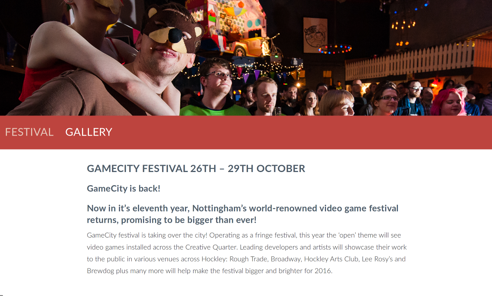

#TODO

- showcase videos

#Games Computing Programme Level 1 Welcome

##Overview

- we're going to play a bunch of games during this session
  - WOOT!!
  - we'll have some prizes

##Structure

- quick showcase
  - including #dungeon
- about me (Shearer)
- a bunch of mundane stuff
- games and more games
- Q&A session

##Showcase

- TODO

##Games Research Group

- promoting and exposing games-related research
- http://games.lincoln.ac.uk

##\#Dungeon

- hashtagDungeon
- http://www.hashtagdungeon.com
- https://twitter.com/HashtagDungeon

##About me (Shearer)

- Programme Leader for Games Computing

###Contact Details

email
: jshearer@lincoln.ac.uk

phone
: 01522 837310

office
: MC3208 (MHT building)

###humanAquarium

- http://humanaquarium.org/

###nightinGallery

- http://www.robyntaylor.com/nightingallery.html

###eyeResonator

- http://www.eyeresonator.com

##Game city trip

- http://gamecity.org/

###GameCity 9
###**25 October - 1 November 2014**
###Nottingham, UK

> At last, a videogame festival for everybody.
  - http://gamecity.org/festival/

- Every year, the best people in video games from around the world come to Nottingham to have the most fun.

- GameCity is about playing, watching, making, eating, shouting - all the best things.

- Together, we're going to find out what a videogame festival should be!

> there is no other festival in the World like GameCity ...
 - *The Guardian*

##mundane stuff

[lea-kane.deviantart.com](http://lea-kane.deviantart.com/art/Mundane-Navi-160049442)

##Programme Leader Role

- Point of contact for students who have difficulties related to the programme
- Oversee pastoral care of students
- Manage health and wellbeing of programmes
- Respond to issues raised by students and staff of a programme nature

##We will look at...

- The programmes
- Timetables
- Where things are
- Facilities in the School
- SoCS Computing Laboratories: rules, etiquette, etc.
- A bit about using computers in the University
- How you should approach studying at University

##The programmes

- 3 or 4 years for the degree
- 2 Semesters per year (A and B)
- 120 CATS points per year
- some modules are 15 CATS points, some of 30

###MComp Programmes

- Some of you are enrolled on MComp rather than BSc...
- Identical to corresponding BSc programmes for first 3 years
- Final year: 2 projects, and optional module(s)
- Points to remember:
  - Same assessments, but pass mark is higher (50%) in years 2 and 3
  - You can transfer later between BSc and MComp (either way)

###Level 1 Modules

| Module | Semesters | CATS |
|---|---|---|
| Programming and Data Structures | A&B | 30 |
| Maths for Computing | A | 15 |
| Web Authoring | A | 15 |
| Introductory Game Studies | A | 15 |
| Computer Architectures | B | 15 |
| Algorithms and Complexity | B | 15 |
| Game Design  | B | 15 |

###Level 2

| Module | Semesters | CATS |
| ---|---|---|
| Professional Practice | A | 15 |
| Human Computer Interaction | A | 15 |
| Object-Oriented Programming | A | 15 |
| Graphics | A | 15 |
| Group Project | B | 15 |
| Game Design 2 | B | 15 |
| Games Programming | B | 15 |
| Artificial Intelligence | B | 15 |

###Level 3

| Module | Semesters | CATS |
| ---|---|---|
| Project | A&B | 30 |
| Advanced Game Studies | A&B | 30 |
| Game Engine Architectures | A | 15 |
| *option*                  | A | 15 |
| Physics Simulation | B | 15 |
| *option* | B | 15 |

####Level 3 Options:

| Option | Semesters | CATS |
| ---|---|---|
| Software Engineering | A | 15 |
| Entrepreneurship and Innovation 1 | A | 15 |
| Business Intelligence | A | 15 |
| Image Processing | A | 15 |
| Mobile Computing | A&B | 30 |
| Parallel Computing | B | 15 |
| Entrepreneurship and Innovation 2 | B | 15 |
| Autonomous Mobile Robotics | B | 15 |
| Critical Perspectives on Project Management | B | 15 |

###Level 4

| Module | Semesters | CATS |
| ---|---|---|
| Research Methods | A | 15 |
| Advanced Graphics | A | 15 |
| *option* | A | 15 |
| MComp Research Project | A&B | 60 (15 then 45) |
| Movement Interfaces | B | 15 |

####Level 4 Options:

| Option | Semesters | CATS |
| ---|---|---|
| Advanced Programming | A | 15 |
| Advanced Artificial Intelligence | A | 15 |
| Advanced Software Engineering | B | 15 |
| Computer Vision | B | 15 |
| Machine Learning | B | 15 |
| **other M variants** | | |

##Timetables

- Your timetable should be available when you log on to the university computer system
- Or via blackboard
- You are studying 4 modules this semester
- Each module should have a lecture (1 or 2 hours) + a workshop session(1 or 2 hours)
- Workshops: Usually in Lab A and B
- You are expected to attend all timetabled sessions: attendance is monitored
- Week1: Special Case – Check Blackboard!

##Where things are

- the School of Computer Science is mainly based on the third floor of MHT building
  - computing labs
  - most of your lecturer's offices (but not all)
  - college office (admin)
- Lab sessions always on the third floor, though "pass key" door
- Access to some staff on the third floor of MHT is through a “pass key” door. Phone on the outside with staff list to contact to be let in.

##Lab Facilities

- 3 Computing Labs: 3rd floor MHT building
- Not running campus install, we manage them and they're on their own subnet
- All used for workshops, but you can also use them when there are no timetabled workshop sessions on
  - Lab A: General use (75)
  - Lab B: Games Development Lab (55)
  - Lab C: specialist equipment (e.g. Robotics, Creative Suites)
  - Fairly “fluid” use to accommodate different sessions
- All use the username "computing" with the password "computing"
  - these are **NOT** private logins, but give you admin rights

##Lab Etiquette

- No casual game playing
- If a workshop session is on - vacate the lab, or do not enter
- Store your work somewhere reliable
  - SkyDrive
  - github/bitbucket
  - a memory stick (though they are **NOT ** reliable and get lost)
  - Consider the machines as non-private, don't store passwords etc
  - The computers are regularly re-ghosted (any work saved on the local hard-drive will disappear)
  - Don't bring food and drink into the lab
  - Treat it like a professional dev studio

##Other Facilities / Equipment

- Robotics stuff (some new fancy ones, a bunch of Rovios and Roombas kicking around), Lego NXT
- Quadcopters (John Murray)
- Xbox 360 development environments
- use with XNA game studio express (though XNA is deprecated ...)
- Mobile phones/game platforms
- Ouyas
- Kinects
- Some Macs
- Raspberry Pis
- random other stuff - keep your eyes open. Talk to people

##Blackboard

- Blackboard is the online learning environment used by the University.
- On Blackboard you will find:
  - Sections for the modules you are studying this semester: lecture notes, workshop materials, etc.
  - announcements, your timetable, etc.
- Most assessments are submitted electronically through Blackboard.
- You can test Blackboard on Friday

Note: can demo with login=“astudent”, password=“astudent”

##Library

- Next to the Engine Shed
- To log into the library system
  - http://www.library.lincoln.ac.uk
  - Separate username and PIN number (which will be emailed to you)
  - Access catalogue, reserve/renew books, access e-books
- Subject Librarian: Adele Beeken
  - http://staff.lincoln.ac.uk/abeeken

##Printing

- Large printers around the university
- You can print from any “standard” computer on campus, and collect from any printer
  - Or from our Labs
- To use printers:
  - login using library username and PIN

##What if I have a Problem?

- Extensive support structure in the University
  - not always obvious where to look for help
- Academic/work problems:
  - With a particular module: Lecturer / Module Coordinator (not always the same person)
  - Your programme leader: Me
  - Your Head of School: David Cobham
  - You should feel that you can ask any member of staff for advice ...
    - this is part of all the staff members' jobs
- Non-Academic: Student Support Centre (Main Academic Building)
- **Remember: issues during Uni are common. Seek help/advice**

##Extra Curricula Activities

- “is this part of our assessment?”
  - Remember why you are here!

- Games jams, game challenges, workshops, competitions...
- Build your portfolio
- Discover your interests
  - sports and societies
  - etc. etc.

##Expectations

- Ours?
  - That you tell someone if you have a problem
  - That you attend timetabled sessions
  - That you follow lab rules
  - That you submit assessments on time
  - That you treat other staff and students appropriately
  - That you are enthusiastic!
- Yours?
  - ??

##Advice

- Games industry is competitive
- Work outside your timetabled hours
- Find your interests
  - Level design, modding, hacking, mobile computing, etc
  - Your lecturers do more than teach
- If you have a problem, tell someone

##Game Time

[misslunaviolet.deviantart.com](http://misslunaviolet.deviantart.com/art/Game-Time-36779346)

##Game 1

1. Get into pairs - with your new friends who are near you

##Game 1 - Rock-Paper-Scissors

1. Get into pairs - with your new friends who are near you
2. Play Rock-Paper-Scissors, best of 3 in your pair
  - 3,2,1,Shoot
  - 3,2,1,Shoot
  - 3,2,1,Shoot
3. All victors on LHS of the room, everyone else on the RHS

Note: need to split into two teams - doing with Rock-Paper-Scissors

##Game 2 - sorting race

- a vaguely Computer Science related game

[Light_on_cinema_queue](http://commons.wikimedia.org/wiki/File:Light_on_cinema_queue.jpg)

##Game 2 - sorting race

1. The two sides of the room will race each other to sort themselves (physically) into a specific order (next slide)
  - there will be a sequence of sort constraints, the first is most important, the later ones being use for ambiguous cases
2. When you think your team is in order, sit down. When your whole team is sitting then jointly shout out **"SORTED!"**
3. We'll then confirm your order.
  - If sorted correctly you win
  - If not, the other team will win

##Game 2 - sorting race - the order

1. **alphabetically** by **SECOND** letter of **FIRST** name
2. **alphabetically** by **THIRD** letter of **LAST** name
3. **numerically** by the **DAY** in the month of **BIRTHDAY**
4. by **HEIGHT**

- When you think your team is in order, sit down. When your whole team is sitting then jointly shout out **"SORTED!"**

Note: using first names so they get to know each other's name

##Game 3 - count off

- each half of the room will break into X teams
- down your sorted line count off from 1 to X, repeating until no-one is left
- group together with people who sounded off the same number
  - staying on your separate sides of the room

##Game 4 - Chocolate Game and Flying Questions Game

- Parallel processing
  - LHS of the room will do Chocolate Game, followed by Flying Questions Game
  - RHS of the room will do Flying Questions Game, followed by Chocolate Game

[en.wikipedia.org/wiki/Chocolate](http://en.wikipedia.org/wiki/Chocolate#mediaviewer/File:Chocolate.jp)
[simple.wikipedia.org/wiki/Paper](http://simple.wikipedia.org/wiki/Paper#mediaviewer/File:Paper_450x450.jpg)

##Game 4A - Chocolate Game

- some of you will have played this game before
- there's some (trivial) logic involved

1. each team will get into a circle
2. each team come fetch:
  - a large bar of chocolate in it's wrapper
    - let me know if you have are allergic to chocolate or nuts or whatever. I have alternative options
  - a scarf
  - a hat
  - a pair of gloves
  - a knife and a fork
  - a die

###Game play - Chocolate Game

- going round the circle, each person rolls the die
- if they roll a 6, then:
  - if someone else already has the hat, scarf, gloves on then make them remove them
  - put on the hat, scarf, gloves
  - try to eat the chocolate using only the knife and fork
    - yum, yum
- repeat ad nauseam ...

##Game 4B - Flying Questions Game

- giving you (hopefully fun) opportunity to ask questions
  - working in a team

- will have to fold/shape your piece of paper to get it as far as possible
  - team who gets their bit of paper the furthest will win prizes each (we'll do this as whole at the end)
- your paper must fulfil the following criteria:
  - at least 4 questions (for me to answer) per team
  - at least 4 answers per team to the question "why do you want to be here studying Games Computing?")

###Game Play - Flying Questions Game

1. each team will work together
2. come get a large sheet of paper and a pen
3. you will have 10 minutes total
  - first 3 minutes, no pens, just discuss
  - then 7 minutes to write questions and answers and fold/shape your paper.
  - I'll stop you and we'll put your folded/shaped paper aside for the competition at the end

###Flying Questions Game Competition

- once both teams have constructed their flying questions

##Q&A

- responding to questions and discussing people's answers to "why do you want to be here studying Games Computing?"

##Stay behind for a chat if you like

